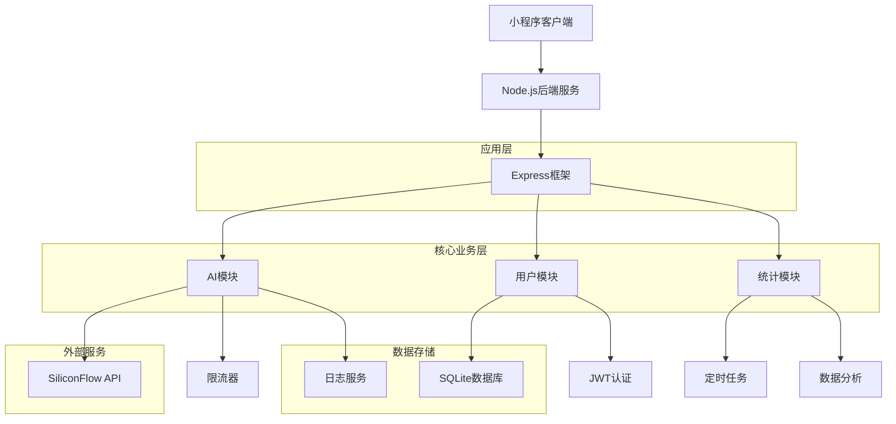

# Focus Homework 后端服务技术架构文档

## 1. 架构设计



## 2. 技术栈描述

- 后端框架: Node.js@18 + Express@4
- 数据库: SQLite3
- 认证: jsonwebtoken
- 日志: Winston
- 限流: express-rate-limit
- 定时任务: node-cron
- 测试: Jest + Supertest
- 容器化: Docker

## 3. 路由定义

| 路由 | 用途 |
|-------|---------|
| /api/auth/register | 用户注册 |
| /api/auth/login | 用户登录 |
| /api/auth/profile | 获取用户信息 |
| /api/ai/chat | AI对话接口 |
| /api/stats/overview | 统计概览 |
| /api/stats/reports | 报表数据 |
| /health | 健康检查 |

## 4. API定义

### 4.1 认证相关API

#### 用户注册
```
POST /api/auth/register
```

请求参数:
| 参数名 | 类型 | 必需 | 描述 |
|-----------|-------------|-------------|-------------|
| username | string | 是 | 用户名 |
| email | string | 是 | 邮箱地址 |
| password | string | 是 | 密码 |

响应示例:
```json
{
  "success": true,
  "data": {
    "userId": "123e4567-e89b-12d3-a456-426614174000",
    "username": "testuser",
    "email": "test@example.com"
  }
}
```

#### 用户登录
```
POST /api/auth/login
```

请求参数:
| 参数名 | 类型 | 必需 | 描述 |
|-----------|-------------|-------------|-------------|
| email | string | 是 | 邮箱地址 |
| password | string | 是 | 密码 |

响应示例:
```json
{
  "success": true,
  "data": {
    "token": "eyJhbGciOiJIUzI1NiIsInR5cCI6IkpXVCJ9...",
    "user": {
      "userId": "123e4567-e89b-12d3-a456-426614174000",
      "username": "testuser",
      "email": "test@example.com"
    }
  }
}
```

### 4.2 AI模块API

#### AI对话
```
POST /api/ai/chat
```

请求头:
```
Authorization: Bearer {token}
```

请求参数:
| 参数名 | 类型 | 必需 | 描述 |
|-----------|-------------|-------------|-------------|
| message | string | 是 | 用户消息 |
| model | string | 否 | 模型类型，默认gpt-3.5-turbo |

响应示例:
```json
{
  "success": true,
  "data": {
    "response": "这是AI的回复内容",
    "model": "gpt-3.5-turbo",
    "usage": {
      "prompt_tokens": 100,
      "completion_tokens": 150,
      "total_tokens": 250
    }
  }
}
```

### 4.3 统计模块API

#### 获取统计概览
```
GET /api/stats/overview
```

请求头:
```
Authorization: Bearer {token}
```

响应示例:
```json
{
  "success": true,
  "data": {
    "totalUsers": 1250,
    "totalApiCalls": 15600,
    "todayApiCalls": 450,
    "activeUsers": 89
  }
}
```

## 5. 服务器架构图

```mermaid
graph TD
    A[客户端请求] --> B[Express中间件]
    B --> C[认证中间件]
    C --> D[限流中间件]
    D --> E[路由控制器]
    
    E --> F[AI控制器]
    E --> G[用户控制器]
    E --> H[统计控制器]
    
    F --> I[AI服务层]
    G --> J[用户服务层]
    H --> K[统计服务层]
    
    I --> L[SiliconFlow API]
    J --> M[用户仓库]
    K --> N[统计仓库]
    
    M --> O[(SQLite)]
    N --> O
    
    subgraph "控制器层"
        F
        G
        H
    end